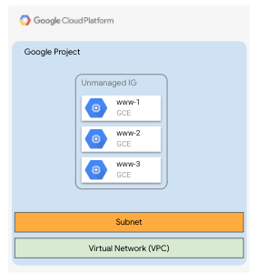

# Infrastructure as Code with Google Cloud Infrastructure Manager

This repo contains a basic Terraform configuration and instructions on how to
deploy this configuration from a local source using the new Google Cloud
Infrastructure Manager. It has been created to illustrate how to deploy a simple
Terraform configuration in an automated with Infrastructure Manager during the
Infrastructure as Code GDG Madrid Workshop celebrated in September 2023 @ Madrid
Google Office.

## Pre-requisites and what you're going to create

To follow this lab you'll need access to a Google Cloud project with Editor
permissions. You'll also need to have the Google Cloud SDK installed in your
local machine, or have access to a Cloud Shell session (that already has the
SDK installed).

The Terraform configuration in this repo will create the following resources:

<div align=center>
  
  <p style="text-align: center;">
    Infrastructure created by Terraform
  </p>
</div>

## Running everything locally

Once you've cloned this repo, move to the `gdg-iac` directory, set the basic
environment variables and hydrate the Terraform variables file:

```bash
cd gdg-iac
export PROJECT_ID=$(gcloud config get-value project)
export REGION="europe-west1"
envsubst < terraform.tfvars.dist > terraform.tfvars
```

Initialize Terraform:

```bash
terraform init
```

Now you can run `terraform apply` to create the resources:

```bash
terraform apply -auto-approve
```

You can go to the Google Cloud Console and check that the resources have been
created.

What you've done now is launch Infrastructure creation from Cloud Shell or your
local machine, using your local filesystem for storing the state. **This is not a
good practice**, as **you should store the state in a remote location**, so that it
can be shared with other users and machines. Also, **it is best that the
`terraform` binary execution is controlled by a pipeline that runs independently
from your shell and that can store a registry of executions and their logs in a
central place**.

In the next section you'll see how to do this, so now you'll delete the
resources you've created so you can start from an empty state.

```bash
terraform destroy -auto-approve
```

## Using Google Cloud Infrastructure Manager

The following diagram depicts the overall architecture and components of
Infrastructure Manager, that may provide a reference for the following
instructions:

<div align=center>
  
  <p style="text-align: center;">
    Google Cloud Infrastructure Conceptual Overview
  </p>
</div>

### Doing the initial Infrastructure Manager setup

Enable the Infrastucture Manager API:

```bash
gcloud services enable config.googleapis.com
```

Now set up the authentication. You'll use a service account for Infrastructure
Manager with the proper permissions:

```bash
SA_NAME="inframanager-sa"

SA_EMAIL="${SA_NAME}@${PROJECT_ID}.iam.gserviceaccount.com"

gcloud iam service-accounts create ${SA_NAME} \
  --display-name "Infrastructure Manager Service Account"

gcloud projects add-iam-policy-binding ${PROJECT_ID} \
  --member serviceAccount:${SA_EMAIL} \
  --role roles/config.agent
```

Set up additional permissions for the service account:

```bash
gcloud projects add-iam-policy-binding ${PROJECT_ID} \
  --member serviceAccount:${SA_EMAIL} \
  --role roles/editor
```

### Creating a deployment

Create a deployment with Infrastructure Manager:

```bash
DEPLOY_PATH="projects/$PROJECT_ID/locations/$REGION/deployments/gdg-iac"
SA_PATH="projects/$PROJECT_ID/serviceAccounts/$SA_EMAIL"

gcloud alpha infra-manager deployments apply $DEPLOY_PATH \
  --service-account=$SA_PATH \
  --local-source=.
```

### Viewing and listing deployments and created resources

You can list existing deployments:

``` bash
gcloud alpha infra-manager deployments list \
  --location $REGION
```

and also check the state of the deployment:

```bash
gcloud alpha infra-manager deployments describe $DEPLOY_PATH
```

You can check the revisions of a deployment:

```bash
gcloud alpha infra-manager revisions list --deployment=$DEPLOY_PATH
```

If any of your attemps to deploy the configuration failed, you can see the
corresponding revision with the failed deployment in the previous list.

You can describe a particular revision using the following command. Replace
`r-0` with the revision ID of the revision you want to get information about
if you've got more than one in the previous listing:

```bash
REV_ID="r-0"
REV_PATH="$DEPLOY_PATH/revisions/$REV_ID"
gcloud alpha infra-manager revisions describe $REV_PATH
```

You can also list the resources created by the deployment:

```bash
gcloud alpha infra-manager resources list --revision=$REV_PATH
```

### Checking the state file

Navigate to the
[Google Cloud Console for Google Cloud Storage](https://console.cloud.google.com/storage).
There should be two buckets:
- one for the deployment artifacts and their corresponding revisions called `$PROJECT_ID_infra_manager_staging`
containing all the uploaded artifacts
- another one called `$PROJECT_NUMBER-$REGION-blueprint-config` containing a
list of the deployment revisions with their apply results and logs.

### Destroying the deployment

To destroy the deployment, run:

```bash
gcloud alpha infra-manager deployments delete $DEPLOY_PATH
```