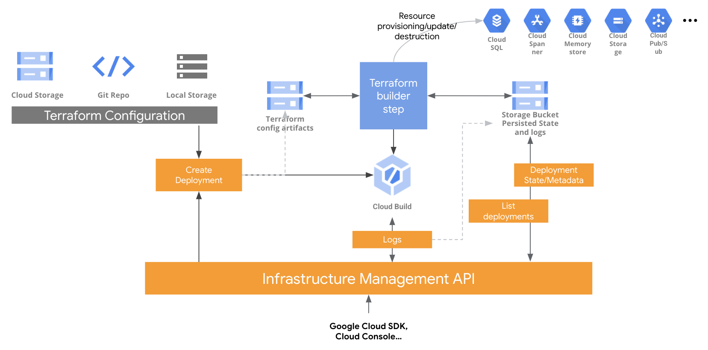

# Infrastructure as Code with Google Cloud Infrastructure Manager

This repo contains a basic Terraform configuration and instructions on how to deploy this configuration from a local source using the new Google Cloud Infrastructure Manager.

The following diagram depicts the overall architecture and components of Infrastructure Manager, that may provide a reference for the following instructions:

<p align="center">
  
  Google Cloud Infrastructure Conceptual Overview
</p>

## Initial set up

Set up your GCP project and hydrate the terraform variables with your environment configuration:

```bash
export PROJECT_ID=$(gcloud config get-value project)
export REGION="europe-west1"
envsubst < terraform.tfvars.dist > terraform.tfvars
```

Enable the Infrastucture Manager API:

```bash
gcloud services enable config.googleapis.com
```

Now set up the authentication. You'll use a service account for Infrastructure Manager with the proper permissions:

```bash
SA_NAME="inframanager-sa"

SA_EMAIL="${SA_NAME}@${PROJECT_ID}.iam.gserviceaccount.com"

gcloud iam service-accounts create ${SA_NAME} \
  --display-name "Infrastructure Manager Service Account"

gcloud projects add-iam-policy-binding ${PROJECT_ID} \
  --member serviceAccount:${SA_EMAIL} \
  --role roles/config.agent
```

Set up additional permissions for the service account:

```bash
gcloud projects add-iam-policy-binding ${PROJECT_ID} \
  --member serviceAccount:${SA_EMAIL} \
  --role roles/editor
```

## Creating a deployment

Create a deployment with Infrastructure Manager:

```bash
DEPLOY_PATH="projects/$PROJECT_ID/locations/$REGION/deployments/gdg-iac"
SA_PATH="projects/$PROJECT_ID/serviceAccounts/$SA_EMAIL"

gcloud alpha infra-manager deployments apply $DEPLOY_PATH \
  --service-account=$SA_PATH \
  --local-source=.
```

## Viewing and listing deployments and created resources

You can list existing deployments:

``` bash
gcloud alpha infra-manager deployments list \
  --location $REGION
```

and also check the state of the deployment:

```bash
gcloud alpha infra-manager deployments describe $DEPLOY_PATH
```

You can check the revisions of a deployment:

```bash
gcloud alpha infra-manager revisions list --deployment=$DEPLOY_PATH
```

If any of your attemps to deploy the configuration failed, you can see the corresponding revision with the failed deployment in the previous list.

```bash
REV_ID="r-0"
REV_PATH="$DEPLOY_PATH/revisions/$REV_ID"
gcloud alpha infra-manager revisions describe $REV_PATH
```

You can also list the resources created by the deployment:

```bash
gcloud alpha infra-manager resources list --revision=$REV_PATH
```

## Checking the state file

Navigate to the [Google Cloud Console for Google Cloud Storage](https://console.cloud.google.com/storage). There should be two buckets, one for the deployment artifacts and their corresponding revisions called `$PROJECT_ID-infra-manager` and another one for the state file called `$PROJECT_ID_infra_manager_staging` containing all the uploaded artifacts and another one called `$PROJECT_NUMBER-$REGION-blueprint-config` containing a list of the deployment revisions with their apply results and logs.

## Destroying a deployment

To destroy the deployment, run:

```bash
gcloud alpha infra-manager deployments delete $DEPLOY_PATH
```